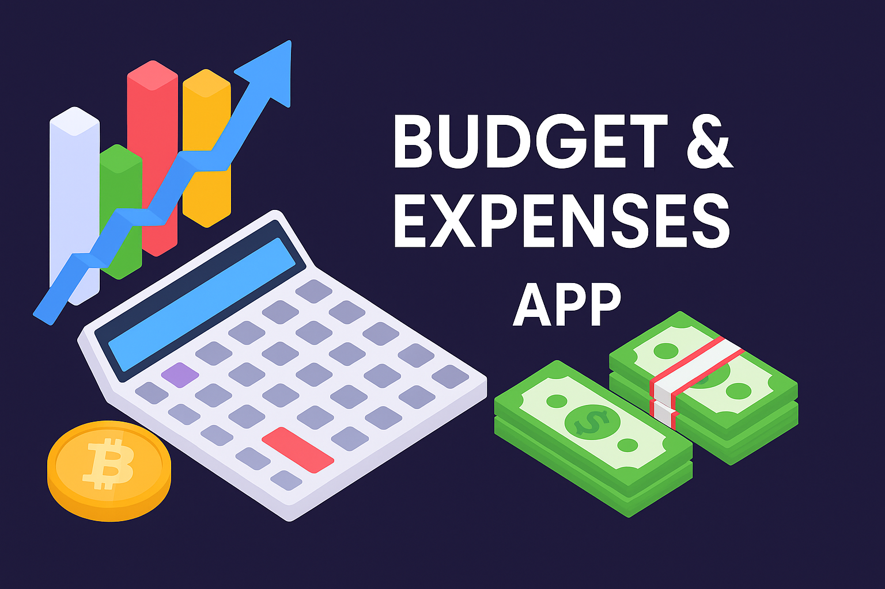
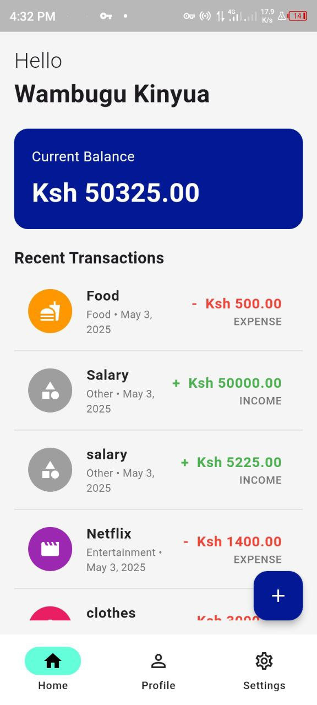
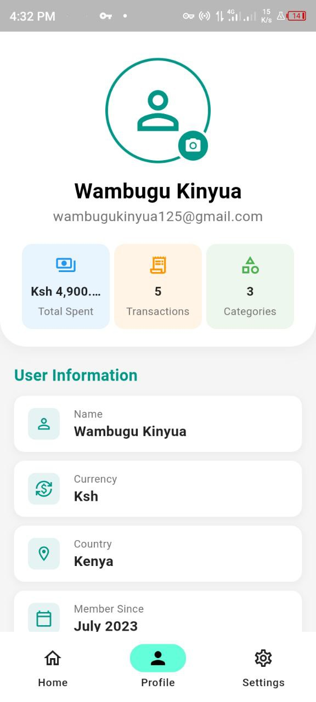
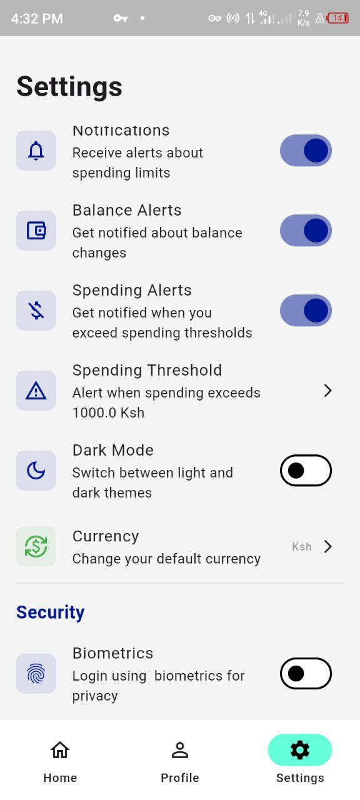
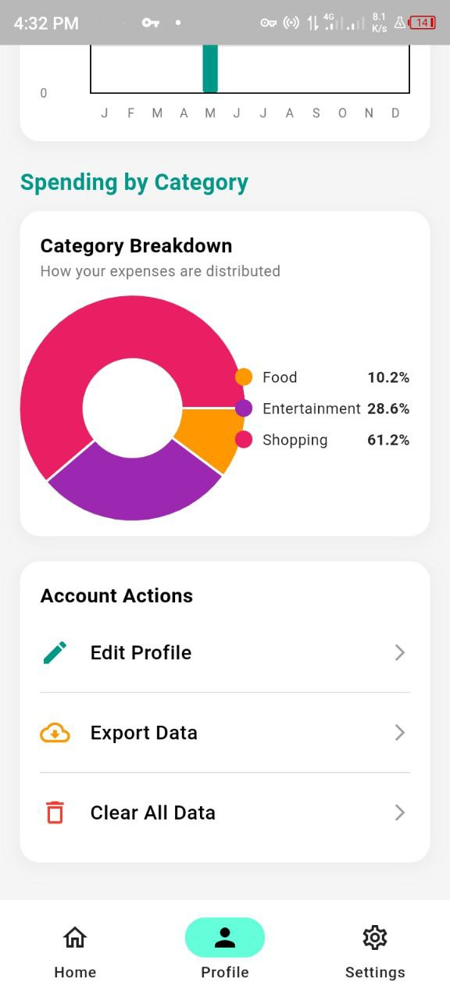

# Expense Tracker App



## Overview

Expense Tracker is a comprehensive personal finance management application built with Flutter. It allows users to track their expenses, monitor their balance, and gain insights into their spending habits. The app features a clean, modern UI with both light and dark themes, biometric authentication, and real-time notifications to help users stay on top of their finances.

## Features

### Core Functionality
- **Balance Management**: Track your overall financial balance
- **Transaction Tracking**: Log and categorize all your expenses and income
- **Category Analysis**: Visualize spending by categories
- **Monthly Statistics**: View your spending patterns over time

### User Experience
- **Biometric Authentication**: Secure your financial data with fingerprint or face recognition
- **Dark/Light Mode**: Choose your preferred theme for comfortable viewing
- **Multiple Currency Support**: Track expenses in your local currency

### Notifications
- **Balance Alerts**: Get notified when your balance changes
- **Spending Threshold Alerts**: Set limits and receive alerts when you exceed them
- **Customizable Notification Settings**: Control which alerts you receive

## Screenshots

<div style="display: flex; justify-content: space-between;">
    
    
    
    
</div>

## Architecture

The app follows a clean architecture with separation of concerns:

### State Management
- **Provider Pattern**: For reactive and efficient state management
- **Hive Database**: For local persistence of user data and settings

### Key Components
- **Models**: Represent the data structures (Transactions, UserSettings, etc.)
- **Providers**: Handle business logic and state updates
- **Services**: Manage external interactions (notifications, biometrics)
- **UI Components**: Present the data and capture user inputs

## Technical Details

### Data Persistence
All app data is stored locally using Hive, a lightweight and fast NoSQL database:

```dart
@HiveType(typeId: 2)
class AppState extends HiveObject {
  @HiveField(0)
  double balance;
  
  @HiveField(1)
  int lastPageIndex;

  AppState({
    this.balance = 0.0,
    this.lastPageIndex = 0,
  });
}

@HiveType(typeId: 3)
class Transaction extends HiveObject {
  @HiveField(0)
  final String id;
  
  @HiveField(1)
  final String title;
  
  @HiveField(2)
  final double amount;
  
  @HiveField(3)
  final DateTime date;
  
  @HiveField(4)
  final String category;
  
  @HiveField(5)
  final String type; // income or expense
  
  // ...
}
```

### Notifications System
The app uses `flutter_local_notifications` to provide timely alerts:

```dart
Future<void> showBalanceNotification({
  required String title,
  required String body,
  required double balance,
}) async {
  const AndroidNotificationDetails androidPlatformChannelSpecifics =
    AndroidNotificationDetails(
      'balance_alerts',
      'Balance Alerts',
      channelDescription: 'Notifications related to your account balance',
      importance: Importance.high,
      priority: Priority.high,
    );
  
  const NotificationDetails platformChannelSpecifics =
    NotificationDetails(android: androidPlatformChannelSpecifics);
  
  await flutterLocalNotificationsPlugin.show(
    DateTime.now().millisecondsSinceEpoch.remainder(100000),
    title,
    body,
    platformChannelSpecifics,
    payload: balance.toString(),
  );
}
```

### Biometric Authentication
The app implements secure access via the device's biometric systems:

```dart
Future<void> _authenticate() async {
  try {
    final bool canAuthenticateWithBiometrics = await auth.canCheckBiometrics;
    final bool canAuthenticate = 
      canAuthenticateWithBiometrics || await auth.isDeviceSupported();
    
    if (!canAuthenticate) {
      setState(() {
        _isAuthenticating = false;
        _authComplete = true;
      });
      return;
    }
    
    final bool authenticated = await auth.authenticate(
      localizedReason: 'Authenticate to access your expense tracker',
      options: const AuthenticationOptions(
        stickyAuth: true,
        biometricOnly: false,
      ),
    );
    
    setState(() {
      _isAuthenticating = false;
      _authComplete = authenticated;
    });
  } catch (e) {
    // Error handling...
  }
}
```

## Getting Started

### Prerequisites
- Flutter SDK (3.6.0 or higher)
- Dart SDK (3.6.0 or higher)
- Android Studio / VS Code with Flutter extensions

### Installation

1. Clone the repository
```bash
git clone https://github.com/yourusername/expense_tracker.git
```

2. Navigate to the project directory
```bash
cd expense_tracker
```

3. Install dependencies
```bash
flutter pub get
```

4. Run the app
```bash
flutter run
```

## Project Structure

```
expense_tracker/
├── lib/
│   ├── db/                   # Database models and services
│   │   └── States_save.dart  # Hive models and storage service
│   ├── pages/                # App screens
│   │   ├── home_page.dart
│   │   ├── profile_page.dart
│   │   └── settings_page.dart
│   ├── providers/            # State management
│   │   ├── balance.dart
│   │   ├── pages_state.dart
│   │   └── theme_handler.dart
│   ├── services/             # External services
│   │   └── notification_service.dart
│   ├── utils/                # Utilities and constants
│   │   └── constants.dart
│   └── main.dart             # App entry point
├── assets/
│   └── images/
│       └── icon.png
└── pubspec.yaml              # Dependencies
```

## Dependencies

- **State Management**
  - `provider: ^6.1.5` - For reactive state management

- **Storage**
  - `hive: ^2.2.3` - Lightweight local NoSQL database
  - `hive_flutter: ^1.1.0` - Flutter integration for Hive

- **UI Components**
  - `fl_chart: ^0.71.0` - Beautiful, customizable charts
  - `intl: ^0.20.2` - For internationalization and date formatting

- **Authentication**
  - `local_auth: ^2.3.0` - Biometric authentication

- **Notifications**
  - `flutter_local_notifications: ^19.1.0` - Local push notifications

- **Utilities**
  - `uuid: ^4.5.1` - Generating unique IDs

## Features in Development

- **Cloud Synchronization**: Back up and restore data across devices
- **Budget Planning**: Set monthly budgets for different categories
- **Financial Goals**: Track progress toward saving goals
- **Receipt Scanning**: Extract expense data from photos of receipts
- **Export Reports**: Generate PDF reports of your financial history

## Contributing

Contributions are welcome! If you'd like to contribute, please:

1. Fork the repository
2. Create a feature branch (`git checkout -b feature/amazing-feature`)
3. Commit your changes (`git commit -m 'Add some amazing feature'`)
4. Push to the branch (`git push origin feature/amazing-feature`)
5. Open a Pull Request

## License

This project is licensed under the MIT License - see the LICENSE file for details.

## Acknowledgements

- [Flutter Team](https://flutter.dev/) for the amazing framework
- [Provider Package](https://pub.dev/packages/provider) for simplified state management
- [Hive](https://pub.dev/packages/hive) for efficient local storage
- All contributors who have helped shape this project

---

## Contact

Project Link: [https://github.com/wambugu71/Budgeting-Expenses-Tracker.git](https://github.com/wambugu71/Budgeting-Expenses-Tracker.git)

## Support

If you find this project helpful, please consider giving it a ⭐️!

